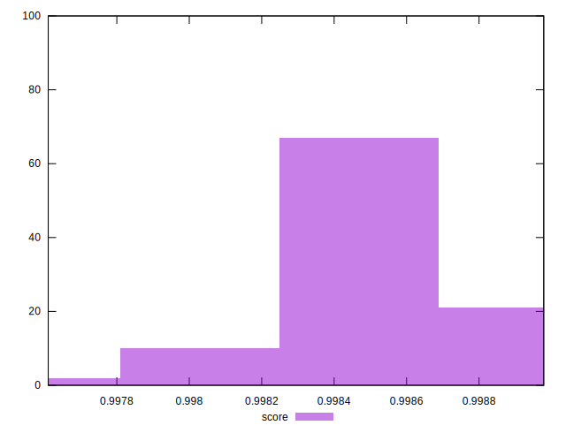

# //mainthread-work-breakdown/samples/pages+cached+noexternal

[→ Parent](../..)


## Raw


```yaml
p90min: 770.0079999999998
p90max: 841.9199999999997
p90range: 71.91199999999992
p90mean: 815.3750222222224
p90median: 819.1000000000005
p90stdev: 17.39713482730728
p90skewness: -0.5960212798710665
p90eccentricity: 0.9999999999999999
p90discretization: 1
outlandishness: 1.0100966443284352

```


## Score


```yaml
p90min: 0.9976105978692127
p90max: 0.9987696536784321
p90range: 0.0011590558092193781
p90mean: 0.9984416634378344
p90median: 0.9984580665420265
p90stdev: 0.00021223505139815834
p90skewness: -1.086546120173528
p90eccentricity: 0.9999999999999999
p90discretization: 1
outlandishness: 1.0000858763158051

```

