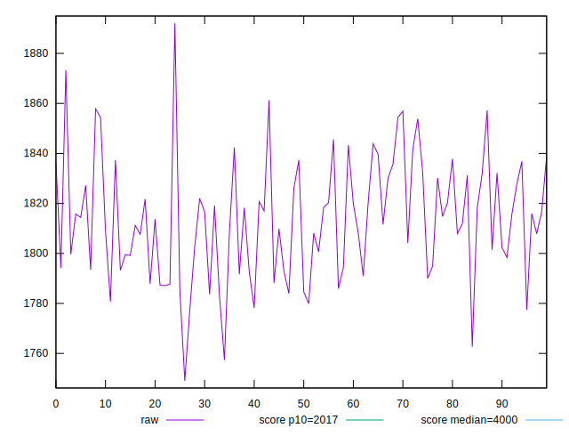
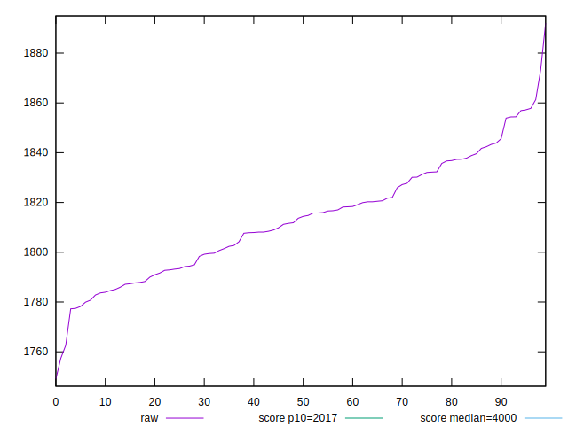

# //mainthread-work-breakdown/samples/pages+cached+nointeractive

[→ Parent](../..)


## Raw


```yaml
p90min: 1777.2560000000008
p90max: 1854.407999999999
p90range: 77.15199999999822
p90mean: 1811.9148131868137
p90median: 1811.8520000000003
p90stdev: 20.2504525891151
p90skewness: 0.15125734937155957
p90eccentricity: 1.0000000000000002
p90discretization: 1
outlandishness: 1.0017716252935356

```


## Score


```yaml
p90min: 0.924905382829474
p90max: 0.935543594936703
p90range: 0.01063821210722904
p90mean: 0.9308359325435548
p90median: 0.9308721256639734
p90stdev: 0.0027861137231056615
p90skewness: -0.18304986007453902
p90eccentricity: 1
p90discretization: 1
outlandishness: 0.9994913270948957

```

