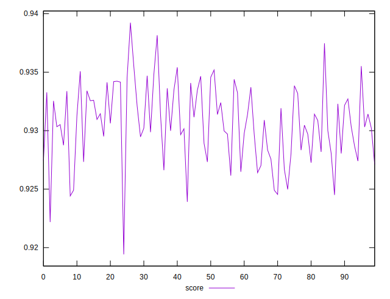
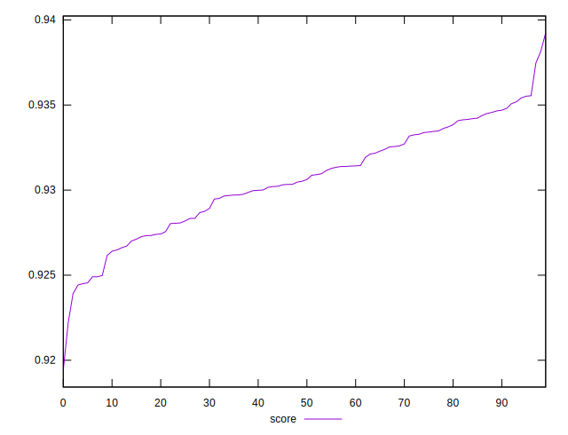
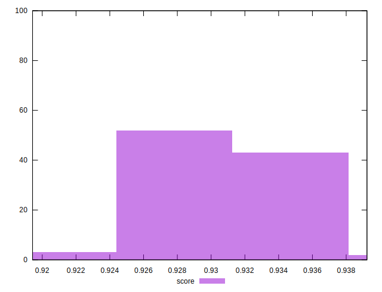

# //mainthread-work-breakdown/samples/pages+cached+nointeractive

[→ Parent](../..)


## Raw


```yaml
p90min: 1749.0479999999998
p90max: 1843.8600000000001
p90range: 94.81200000000035
p90mean: 1808.2775555555554
p90median: 1809.3840000000005
p90stdev: 20.810460649026837
p90skewness: -0.3109506258260567
p90eccentricity: 0.9999999999999999
p90discretization: 1
outlandishness: 1.0058057029571952

```


## Score


```yaml
p90min: 0.9194252963150875
p90max: 0.9346548475801201
p90range: 0.01522955126503256
p90mean: 0.9299868602431582
p90median: 0.930266372291707
p90stdev: 0.0031317517958100853
p90skewness: -0.6767319211356807
p90eccentricity: 0.9999999999999999
p90discretization: 1
outlandishness: 1.0013172191335027

```

