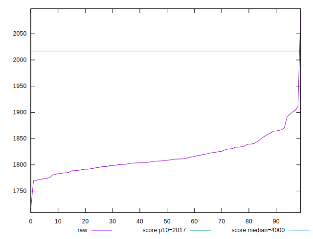
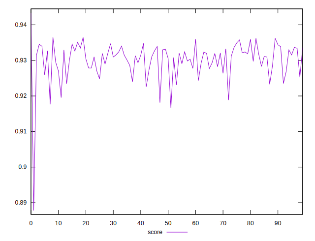

# //mainthread-work-breakdown/samples/pages+cached

[→ Parent](../..)


## Raw


```yaml
p90min: 1769.560000000001
p90max: 1865.6559999999997
p90range: 96.09599999999864
p90mean: 1810.2359999999996
p90median: 1806.9560000000008
p90stdev: 23.306319927681166
p90skewness: 0.5026764240954512
p90eccentricity: 1.0000000000000004
p90discretization: 1
outlandishness: 1.008357872480784

```


## Score


```yaml
p90min: 0.9232884971728587
p90max: 0.9365605245969499
p90range: 0.013272027424091282
p90mean: 0.931057467157495
p90median: 0.9315430940732167
p90stdev: 0.003214784722066665
p90skewness: -0.5532586273794805
p90eccentricity: 1.0000000000000002
p90discretization: 1
outlandishness: 0.9975978509388452

```


## P Score


```yaml
p90min: 0.9232884971728587
p90max: 0.9365605245969499
p90range: 0.013272027424091282
p90mean: 0.931057467157495
p90median: 0.9315430940732167
p90stdev: 0.003214784722066665
p90skewness: -0.5532586273794805
p90eccentricity: 1.0000000000000002
p90discretization: 1
outlandishness: 0.9975978509388452

```


## Score Difference


```yaml
p90min: -0.004929205657261293
p90max: 0.003521624877363405
p90range: 0.008450830534624698
p90mean: -0.0012217566076923024
p90median: -0.0015611391627765592
p90stdev: 0.0023625827755797686
p90skewness: 0.38339294578737065
p90eccentricity: 0.9999999999999993
p90discretization: 1
outlandishness: 0.3653940346576858

```


## P Score Difference


```yaml
p90min: 0
p90max: 0
p90range: 0
p90mean: 0
p90median: 0
p90stdev: 0
p90skewness: .nan
p90eccentricity: .nan
p90discretization: 91
outlandishness: .nan

```

