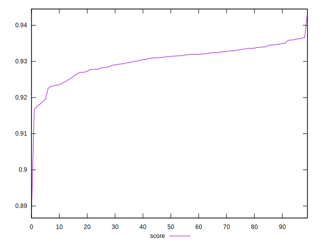

# //mainthread-work-breakdown/samples/pages+cached

[→ Parent](../..)


## Raw


```yaml
p90min: 1716.1960000000008
p90max: 1864.1839999999997
p90range: 147.98799999999892
p90mean: 1807.9723555555559
p90median: 1806.1200000000003
p90stdev: 23.989756040772967
p90skewness: -0.1849384543684806
p90eccentricity: 1.0000000000000002
p90discretization: 1
outlandishness: 1.0108844516220097

```


## Score


```yaml
p90min: 0.887794084686461
p90max: 0.9347750172452193
p90range: 0.04698093255875824
p90mean: 0.929192480254459
p90median: 0.9309753920151989
p90stdev: 0.00601682837798578
p90skewness: -3.9257591410959423
p90eccentricity: 0.9999999999999999
p90discretization: 1
outlandishness: 1.0016064370660063

```

