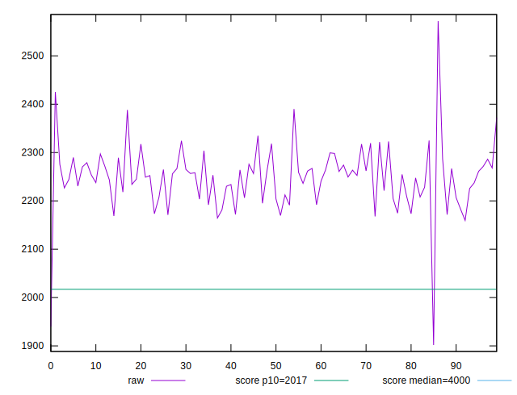
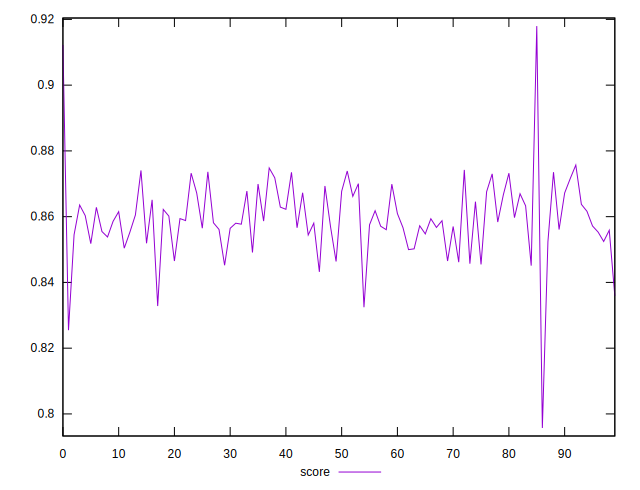

# //mainthread-work-breakdown/samples/pages

[→ Parent](../..)


## Raw


```yaml
p90min: 1901.8560000000002
p90max: 2319.387999999964
p90range: 417.5319999999638
p90mean: 2233.0527999999854
p90median: 2248.305999999985
p90stdev: 62.2579173987233
p90skewness: -2.748751996340396
p90eccentricity: 1.0000000000000004
p90discretization: 1
outlandishness: 1.0129964536418488

```


## Score


```yaml
p90min: 0.7957300190824915
p90max: 0.8732230512381671
p90range: 0.0774930321556756
p90mean: 0.8569080458575505
p90median: 0.8578583673272968
p90stdev: 0.011167866989288462
p90skewness: -2.172510532073755
p90eccentricity: 0.9999999999999996
p90discretization: 1
outlandishness: 1.0059470293179174

```

