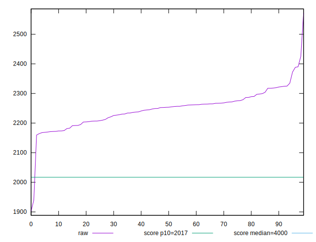
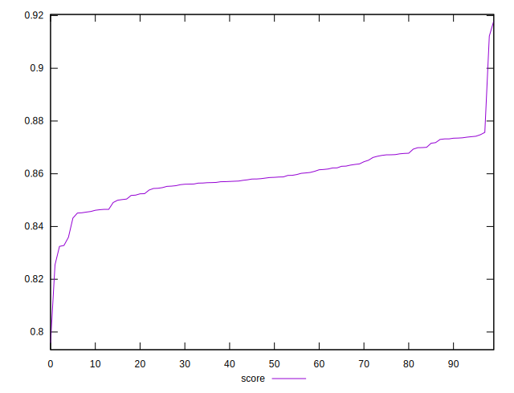
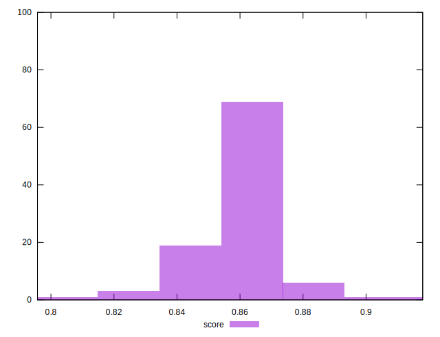

# //mainthread-work-breakdown/samples/pages

[→ Parent](../..)


## Raw


```yaml
p90min: 2164.527999999989
p90max: 2324.895999999975
p90range: 160.3679999999863
p90mean: 2244.6963076922925
p90median: 2252.5759999999873
p90stdev: 42.99641636272673
p90skewness: -0.11743403929886648
p90eccentricity: 0.9999999999999986
p90discretization: 1
outlandishness: 1.002514642486201

```


## Score


```yaml
p90min: 0.8451005169172499
p90max: 0.8748091752455034
p90range: 0.029708658328253534
p90mean: 0.8601512469143608
p90median: 0.8587661970481913
p90stdev: 0.007958472936772421
p90skewness: 0.0796929946891443
p90eccentricity: 0.9999999999999996
p90discretization: 1
outlandishness: 0.9983754821687494

```

