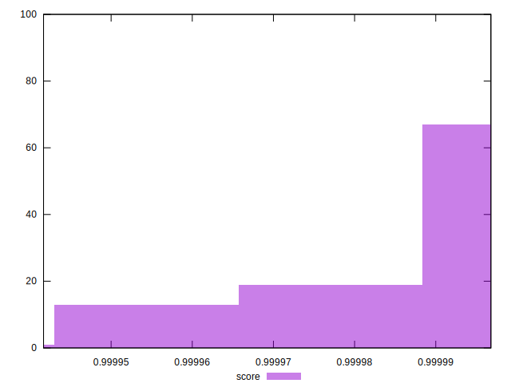

# //max-potential-fid/samples/pages+cached+noadtech

[→ Parent](../..)


## Raw


```yaml
p90min: 25
p90max: 33
p90range: 8
p90mean: 27.417582417582416
p90median: 26
p90stdev: 2.449785521295732
p90skewness: 1.0009736158442097
p90eccentricity: 0.9999999999999997
p90discretization: 11.375
outlandishness: 1.0392147666073632

```


## Score


```yaml
p90min: 0.9999638148729413
p90max: 0.9999967944940666
p90range: 0.0000329796211253619
p90mean: 0.9999901808072267
p90median: 0.9999954072993993
p90stdev: 0.000009190992502921837
p90skewness: -1.5957296347443755
p90eccentricity: 1.0000000000000009
p90discretization: 11.375
outlandishness: 0.9999946114674967

```

