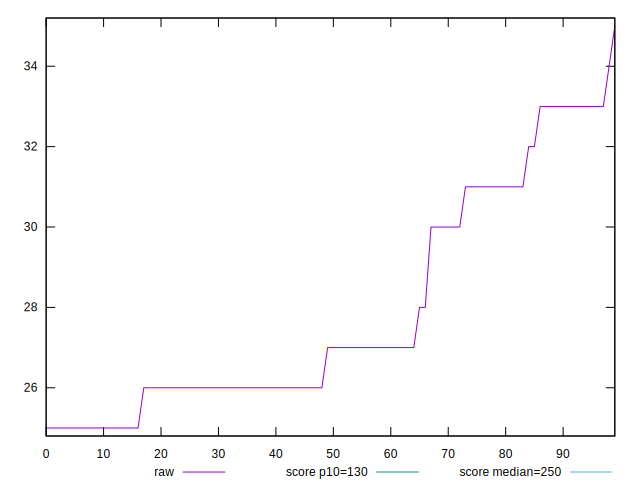

# //max-potential-fid/samples/pages+cached+noadtech

[→ Parent](../..)


## Raw


```yaml
p90min: 25
p90max: 33
p90range: 8
p90mean: 27.355555555555554
p90median: 26
p90stdev: 2.3912391539446665
p90skewness: 1.0247357110889923
p90eccentricity: 1.0000000000000042
p90discretization: 11.25
outlandishness: 1.0439328071000902

```


## Score


```yaml
p90min: 0.9999416738899494
p90max: 0.9999967944940666
p90range: 0.00005512060411727582
p90mean: 0.9999864523493273
p90median: 0.9999935431491718
p90stdev: 0.000012710205741388807
p90skewness: -1.292365655579721
p90eccentricity: 1.0000000000000016
p90discretization: 9
outlandishness: 1.0000020684580397

```

