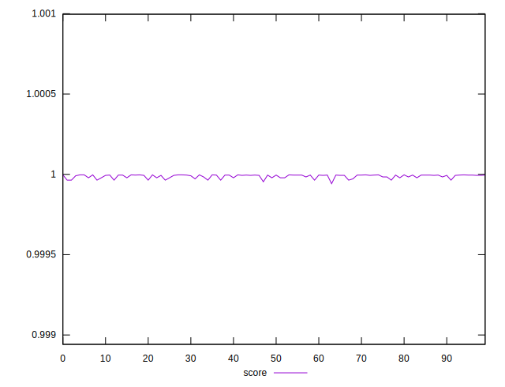
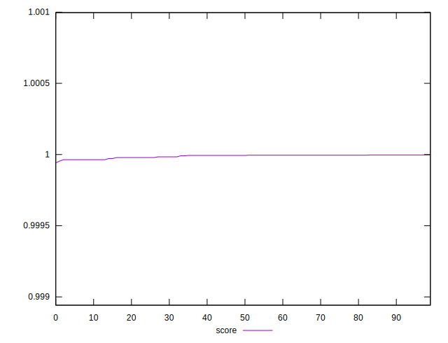

# //max-potential-fid/samples/pages+cached+noadtech

[→ Parent](../..)


## Raw


```yaml
p90min: 25
p90max: 33
p90range: 8
p90mean: 27.417582417582416
p90median: 26
p90stdev: 2.449785521295731
p90skewness: 1.0009736158442106
p90eccentricity: 1.0000000000000007
p90discretization: 11.375
outlandishness: 1.0392147666073632

```


## Score


```yaml
p90min: 0.9999638148729413
p90max: 0.9999967944940666
p90range: 0.0000329796211253619
p90mean: 0.9999901808072266
p90median: 0.9999954072993993
p90stdev: 0.00000919099250292184
p90skewness: -1.5957296347081384
p90eccentricity: 0.9999999999999986
p90discretization: 11.375
outlandishness: 0.9999946114674969

```


## P Score


```yaml
p90min: 0.9999638148729413
p90max: 0.9999967944940666
p90range: 0.0000329796211253619
p90mean: 0.9999901808072266
p90median: 0.9999954072993993
p90stdev: 0.00000919099250292184
p90skewness: -1.5957296347081384
p90eccentricity: 0.9999999999999986
p90discretization: 11.375
outlandishness: 0.9999946114674969

```


## Score Difference


```yaml
p90min: 0.000003205505933356889
p90max: 0.00003618512705871879
p90range: 0.0000329796211253619
p90mean: 0.000009819192773146086
p90median: 0.000004592700600714039
p90stdev: 0.000009190992502921833
p90skewness: 1.595729634655976
p90eccentricity: 1.0000000000000004
p90discretization: 11.375
outlandishness: 1.62405822267097

```


## P Score Difference


```yaml
p90min: 0
p90max: 0
p90range: 0
p90mean: 0
p90median: 0
p90stdev: 0
p90skewness: .nan
p90eccentricity: .nan
p90discretization: 91
outlandishness: .nan

```

