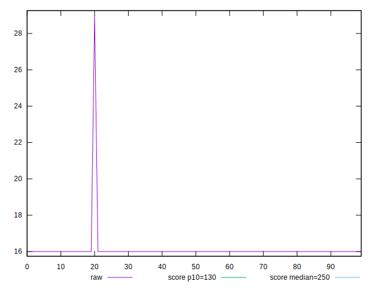
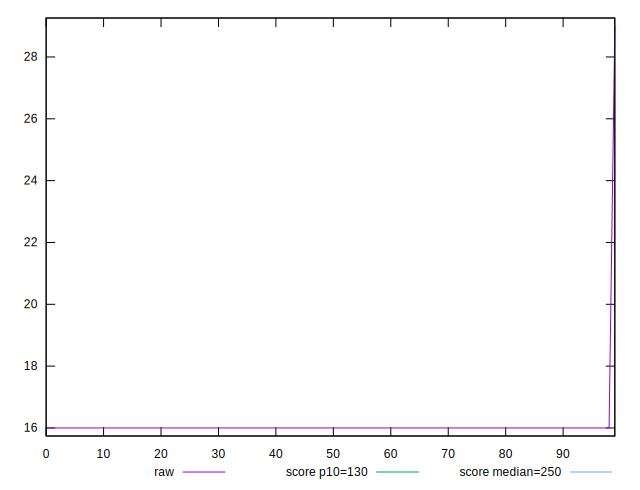
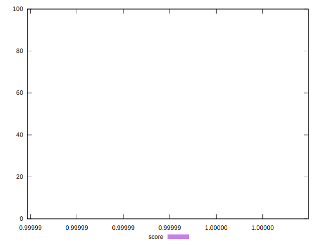

# //max-potential-fid/samples/pages+cached+noexternal+nofonts+nosvg+noimg+nocss

[→ Parent](../..)


## Raw


```yaml
p90min: 16
p90max: 16
p90range: 0
p90mean: 16
p90median: 16
p90stdev: 0
p90skewness: .nan
p90eccentricity: .nan
p90discretization: 90
outlandishness: 1.016316015625

```


## Score


```yaml
p90min: 0.9999878682154684
p90max: 0.9999999641342965
p90range: 0.00001209591882811445
p90mean: 0.9999998297351965
p90median: 0.9999999641342965
p90stdev: 0.0000012679185555479994
p90skewness: -9.327981339893809
p90eccentricity: 0.999999999999993
p90discretization: 45
outlandishness: 1.0000000268798235

```

