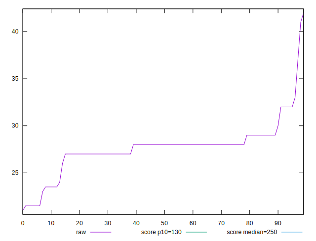

# //max-potential-fid/samples/pages+cached+noexternal+nofonts+nosvg+noimg

[→ Parent](../..)


## Raw


```yaml
p90min: 21.5
p90max: 33
p90range: 11.5
p90mean: 27.714285714285715
p90median: 28
p90stdev: 1.890030026424164
p90skewness: -0.3360948223467313
p90eccentricity: 1.0000000000000004
p90discretization: 8.272727272727273
outlandishness: 0.9993300091667552

```


## Score


```yaml
p90min: 0.9999837437537082
p90max: 0.9999993949667043
p90range: 0.00001565121299607064
p90mean: 0.9999924841293284
p90median: 0.9999910785021199
p90stdev: 0.000003273533158903648
p90skewness: 0.5258399305510418
p90eccentricity: 1.0000000000000013
p90discretization: 9.1
outlandishness: 0.9999873317241735

```


## P Score


```yaml
p90min: 0.9999837437537082
p90max: 0.9999993949667043
p90range: 0.00001565121299607064
p90mean: 0.9999924841293284
p90median: 0.9999910785021199
p90stdev: 0.000003273533158903648
p90skewness: 0.5258399305510418
p90eccentricity: 1.0000000000000013
p90discretization: 9.1
outlandishness: 0.9999873317241735

```


## Score Difference


```yaml
p90min: 6.050332956863969e-7
p90max: 0.000016256246291757037
p90range: 0.00001565121299607064
p90mean: 0.0000075158706721089545
p90median: 0.000008921497880121088
p90stdev: 0.0000032735331589036506
p90skewness: -0.5258399310139253
p90eccentricity: 0.9999999999999996
p90discretization: 9.1
outlandishness: 3.3957816782872423

```


## P Score Difference


```yaml
p90min: 0
p90max: 0
p90range: 0
p90mean: 0
p90median: 0
p90stdev: 0
p90skewness: .nan
p90eccentricity: .nan
p90discretization: 91
outlandishness: .nan

```

