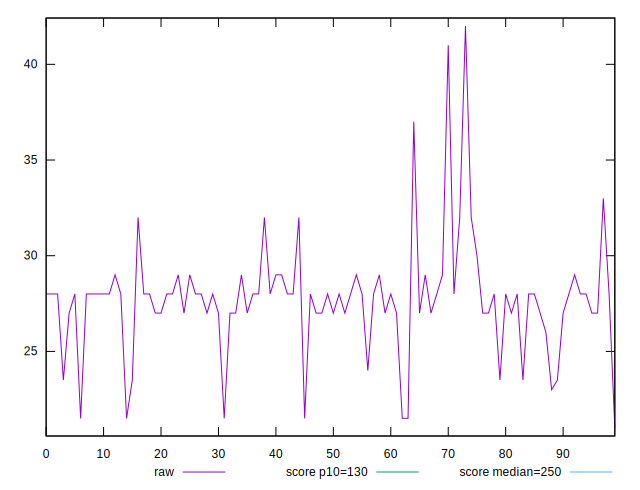
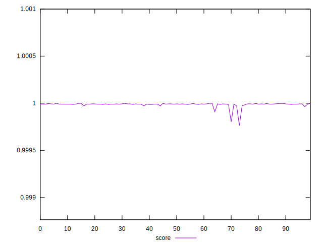

# //max-potential-fid/samples/pages+cached+noexternal+nofonts+nosvg+noimg

[→ Parent](../..)


## Raw


```yaml
p90min: 21
p90max: 29
p90range: 8
p90mean: 26.97222222222222
p90median: 28
p90stdev: 2.07814167936312
p90skewness: -1.6840126411930003
p90eccentricity: 1.0000000000000047
p90discretization: 10
outlandishness: 1.0550738294155644

```


## Score


```yaml
p90min: 0.9997636670093073
p90max: 0.9999982031780541
p90range: 0.00023453616874680172
p90mean: 0.9999847249033399
p90median: 0.9999910785021199
p90stdev: 0.00003223395267994144
p90skewness: -5.73605936287754
p90eccentricity: 1.0000000000000009
p90discretization: 7.5
outlandishness: 1.0000028502768117

```

