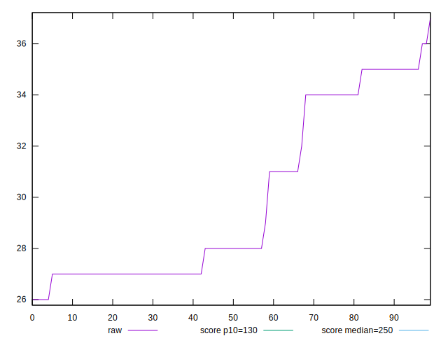
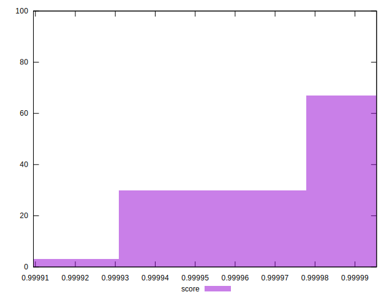

# //max-potential-fid/samples/pages+cached+noexternal+nofonts

[→ Parent](../..)


## Raw


```yaml
p90min: 26
p90max: 35
p90range: 9
p90mean: 29.344444444444445
p90median: 28
p90stdev: 3.127516270891549
p90skewness: 0.7996651717848605
p90eccentricity: 0.9999999999999986
p90discretization: 11.25
outlandishness: 1.0416980949209025

```


## Score


```yaml
p90min: 0.9999095029848146
p90max: 0.9999935431491718
p90range: 0.00008404016435714645
p90mean: 0.9999742579980568
p90median: 0.9999910785021199
p90stdev: 0.000022919899780887973
p90skewness: -0.7469964564375652
p90eccentricity: 1.0000000000000024
p90discretization: 10
outlandishness: 1.000004043553423

```

