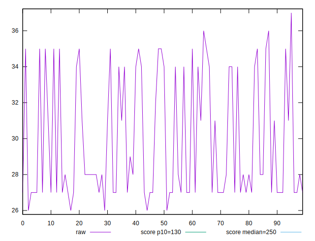

# //max-potential-fid/samples/pages+cached+noexternal+nofonts

[→ Parent](../..)


## Raw


```yaml
p90min: 26
p90max: 35
p90range: 9
p90mean: 29.406593406593405
p90median: 28
p90stdev: 3.1656744918781463
p90skewness: 0.7663772130977183
p90eccentricity: 0.9999999999999986
p90discretization: 11.375
outlandishness: 1.0372996226352387

```


## Score


```yaml
p90min: 0.9999416738899494
p90max: 0.9999954072993993
p90range: 0.00005373340944991867
p90mean: 0.9999803777935234
p90median: 0.9999910785021199
p90stdev: 0.000019026035909707632
p90skewness: -1.056364356629614
p90eccentricity: 1.0000000000000007
p90discretization: 11.375
outlandishness: 0.9999918037102785

```

