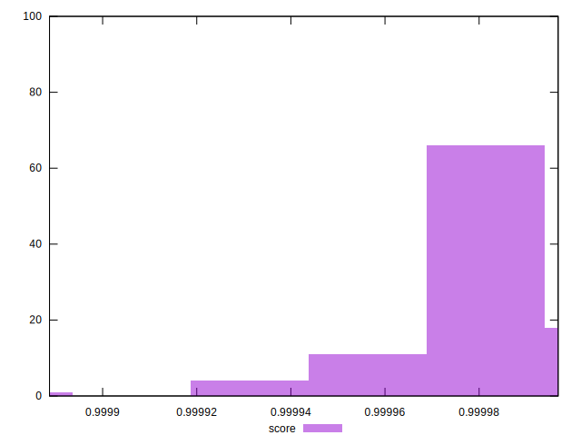

# //max-potential-fid/samples/pages+cached+noexternal+noimg

[→ Parent](../..)


## Raw


```yaml
p90min: 25
p90max: 34
p90range: 9
p90mean: 27.78021978021978
p90median: 27
p90stdev: 2.095532651750813
p90skewness: 1.7965967668160474
p90eccentricity: 1.0000000000000016
p90discretization: 10.11111111111111
outlandishness: 1.0465905103974726

```


## Score


```yaml
p90min: 0.9999538249219597
p90max: 0.9999967944940666
p90range: 0.000042969572106921206
p90mean: 0.9999895969992999
p90median: 0.9999935431491718
p90stdev: 0.000010165242920537874
p90skewness: -2.517308997758021
p90eccentricity: 0.9999999999999992
p90discretization: 10.11111111111111
outlandishness: 0.9999912865944841

```


## P Score


```yaml
p90min: 0.9999538249219597
p90max: 0.9999967944940666
p90range: 0.000042969572106921206
p90mean: 0.9999895969992999
p90median: 0.9999935431491718
p90stdev: 0.000010165242920537874
p90skewness: -2.517308997758021
p90eccentricity: 0.9999999999999992
p90discretization: 10.11111111111111
outlandishness: 0.9999912865944841

```


## Score Difference


```yaml
p90min: 0.000003205505933356889
p90max: 0.000046175078040278095
p90range: 0.000042969572106921206
p90mean: 0.00001040300070066856
p90median: 0.000006456850828229221
p90stdev: 0.000010165242920537867
p90skewness: 2.51730899772094
p90eccentricity: 1.0000000000000002
p90discretization: 10.11111111111111
outlandishness: 2.0129634989817897

```


## P Score Difference


```yaml
p90min: 0
p90max: 0
p90range: 0
p90mean: 0
p90median: 0
p90stdev: 0
p90skewness: .nan
p90eccentricity: .nan
p90discretization: 91
outlandishness: .nan

```

