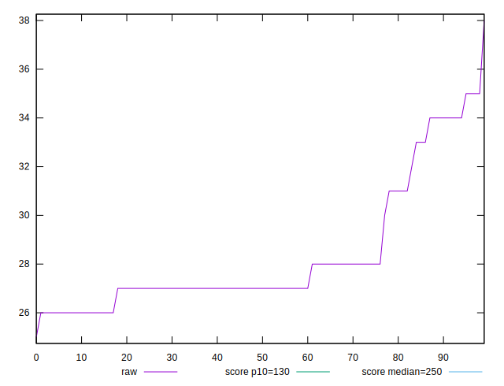

# //max-potential-fid/samples/pages+cached+noexternal+noimg

[→ Parent](../..)


## Raw


```yaml
p90min: 25
p90max: 34
p90range: 9
p90mean: 27.711111111111112
p90median: 27
p90stdev: 2.0013575639463936
p90skewness: 1.8553769958210922
p90eccentricity: 0.9999999999999973
p90discretization: 10
outlandishness: 1.0518171984856681

```


## Score


```yaml
p90min: 0.9998887110535106
p90max: 0.9999954072993993
p90range: 0.00010669624588866
p90mean: 0.9999840952560973
p90median: 0.9999935431491718
p90stdev: 0.000018501170652493748
p90skewness: -2.402762414920856
p90eccentricity: 1.000000000000002
p90discretization: 9
outlandishness: 1.00000229019029

```

