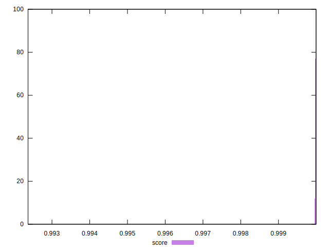

# //max-potential-fid/samples/pages+cached+noexternal+nosvg

[→ Parent](../..)


## Raw


```yaml
p90min: 26
p90max: 32
p90range: 6
p90mean: 27.516483516483518
p90median: 27
p90stdev: 1.2611057189402002
p90skewness: 2.083227125082298
p90eccentricity: 0.9999999999999996
p90discretization: 15.166666666666666
outlandishness: 1.0603776601566888

```


## Score


```yaml
p90min: 0.9999638148729413
p90max: 0.9999954072993993
p90range: 0.00003159242645800475
p90mean: 0.999989547504076
p90median: 0.9999935431491718
p90stdev: 0.0000074810183714928155
p90skewness: -1.963027764564069
p90eccentricity: 1.0000000000000013
p90discretization: 13
outlandishness: 0.9998484714999923

```

