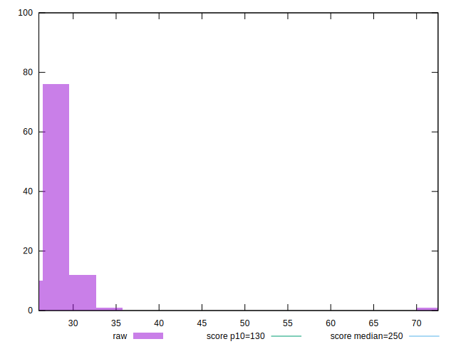

# //max-potential-fid/samples/pages+cached+noexternal+nosvg

[→ Parent](../..)


## Raw


```yaml
p90min: 26
p90max: 32
p90range: 6
p90mean: 27.516483516483518
p90median: 27
p90stdev: 1.2611057189402002
p90skewness: 2.0832271250823
p90eccentricity: 0.9999999999999993
p90discretization: 15.166666666666666
outlandishness: 1.0603776601566888

```


## Score


```yaml
p90min: 0.9999638148729413
p90max: 0.9999954072993993
p90range: 0.00003159242645800475
p90mean: 0.999989547504076
p90median: 0.9999935431491718
p90stdev: 0.0000074810183714928155
p90skewness: -1.9630277645640688
p90eccentricity: 1.0000000000000016
p90discretization: 13
outlandishness: 0.9998484714999923

```


## P Score


```yaml
p90min: 0.9999638148729413
p90max: 0.9999954072993993
p90range: 0.00003159242645800475
p90mean: 0.999989547504076
p90median: 0.9999935431491718
p90stdev: 0.0000074810183714928155
p90skewness: -1.9630277645640688
p90eccentricity: 1.0000000000000016
p90discretization: 13
outlandishness: 0.9998484714999923

```


## Score Difference


```yaml
p90min: 0.000004592700600714039
p90max: 0.00002804871814410248
p90range: 0.00002345601754338844
p90mean: 0.000008301017361195446
p90median: 0.000006456850828229221
p90stdev: 0.00000482300651049046
p90skewness: 3.190546427342409
p90eccentricity: 1.0000000000000004
p90discretization: 15.166666666666666
outlandishness: 2.756194710915777

```


## P Score Difference


```yaml
p90min: 0
p90max: 0
p90range: 0
p90mean: 0
p90median: 0
p90stdev: 0
p90skewness: .nan
p90eccentricity: .nan
p90discretization: 91
outlandishness: .nan

```

