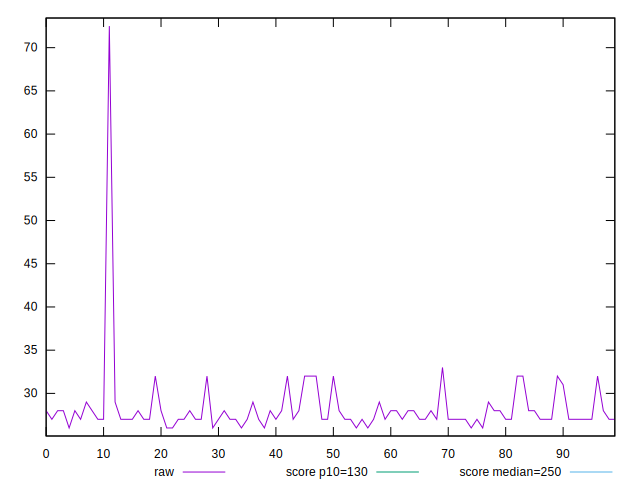
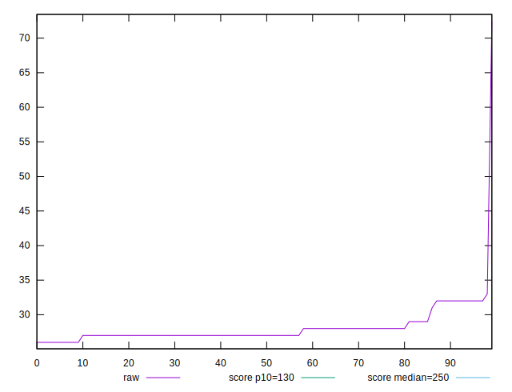
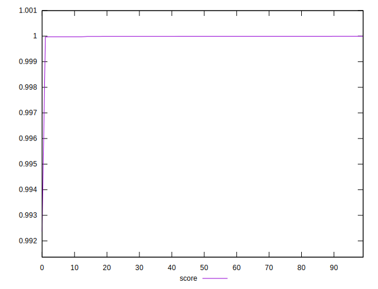

# //max-potential-fid/samples/pages+cached+noexternal+nosvg

[→ Parent](../..)


## Raw


```yaml
p90min: 26
p90max: 32
p90range: 6
p90mean: 27.466666666666665
p90median: 27
p90stdev: 1.1756794725698918
p90skewness: 2.1106583225673576
p90eccentricity: 1.000000000000003
p90discretization: 15
outlandishness: 1.0642276052467246

```


## Score


```yaml
p90min: 0.9923660363038256
p90max: 0.9999935431491718
p90range: 0.007627506845346188
p90mean: 0.9999047116063997
p90median: 0.9999935431491718
p90stdev: 0.0007991329020373949
p90skewness: -9.326732443146287
p90eccentricity: 1.000000000000005
p90discretization: 12.857142857142858
outlandishness: 1.0000181409494862

```

