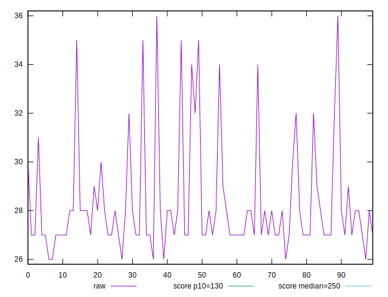
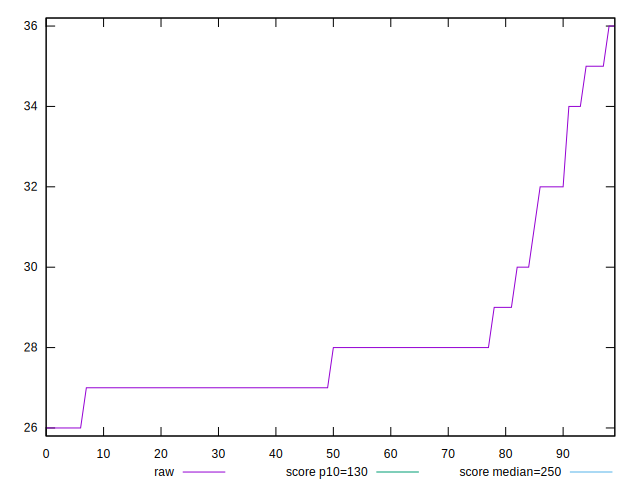

# //max-potential-fid/samples/pages+cached+noexternal

[→ Parent](../..)


## Raw


```yaml
p90min: 26
p90max: 32
p90range: 6
p90mean: 27.736263736263737
p90median: 27
p90stdev: 1.3654702916051917
p90skewness: 1.7779453787867452
p90eccentricity: 1.0000000000000013
p90discretization: 13
outlandishness: 1.046957050100336

```


## Score


```yaml
p90min: 0.9999719512818559
p90max: 0.9999954072993993
p90range: 0.00002345601754338844
p90mean: 0.9999910041386177
p90median: 0.9999935431491718
p90stdev: 0.000005326350014321561
p90skewness: -2.6545056950771233
p90eccentricity: 1.0000000000000009
p90discretization: 13
outlandishness: 0.9999912635327085

```


## P Score


```yaml
p90min: 0.9999719512818559
p90max: 0.9999954072993993
p90range: 0.00002345601754338844
p90mean: 0.9999910041386177
p90median: 0.9999935431491718
p90stdev: 0.000005326350014321561
p90skewness: -2.6545056950771233
p90eccentricity: 1.0000000000000009
p90discretization: 13
outlandishness: 0.9999912635327085

```


## Score Difference


```yaml
p90min: 0.000004592700600714039
p90max: 0.00002804871814410248
p90range: 0.00002345601754338844
p90mean: 0.00000899586138256971
p90median: 0.000006456850828229221
p90stdev: 0.000005326350014321563
p90skewness: 2.654505694774769
p90eccentricity: 1.0000000000000007
p90discretization: 13
outlandishness: 2.2069457962906127

```


## P Score Difference


```yaml
p90min: 0
p90max: 0
p90range: 0
p90mean: 0
p90median: 0
p90stdev: 0
p90skewness: .nan
p90eccentricity: .nan
p90discretization: 91
outlandishness: .nan

```

