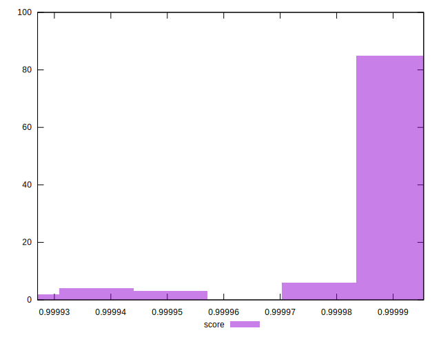

# //max-potential-fid/samples/pages+cached+noexternal

[→ Parent](../..)


## Raw


```yaml
p90min: 26
p90max: 32
p90range: 6
p90mean: 27.68888888888889
p90median: 27
p90stdev: 1.296529079627983
p90skewness: 1.8144903442449427
p90eccentricity: 1.0000000000000016
p90discretization: 12.857142857142858
outlandishness: 1.0505427383679138

```


## Score


```yaml
p90min: 0.9999270232664161
p90max: 0.9999935431491718
p90range: 0.00006651988275563347
p90mean: 0.999985723476994
p90median: 0.9999910785021199
p90stdev: 0.000015629321185934856
p90skewness: -2.426557891451716
p90eccentricity: 0.9999999999999992
p90discretization: 10
outlandishness: 1.0000018249423532

```

