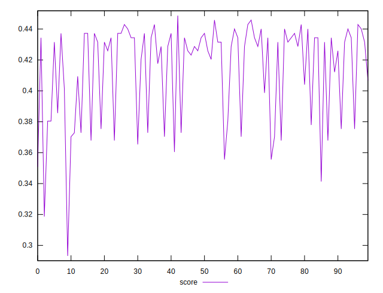

# //max-potential-fid/samples/pages+cached+nointeractive

[→ Parent](../..)


## Raw


```yaml
p90min: 267
p90max: 297.0000000000018
p90range: 30.00000000000182
p90mean: 277.4725274725274
p90median: 273
p90stdev: 9.370682196119644
p90skewness: 1.11578566073711
p90eccentricity: 0.9999999999999999
p90discretization: 1.9782608695652173
outlandishness: 1.0189555211859227

```


## Score


```yaml
p90min: 0.36782727249667685
p90max: 0.4487066999006886
p90range: 0.08087942740401177
p90mean: 0.41966084303028345
p90median: 0.43152934857222425
p90stdev: 0.025175635277933702
p90skewness: -1.0876122416169873
p90eccentricity: 1
p90discretization: 1.9782608695652173
outlandishness: 0.968403725013111

```

