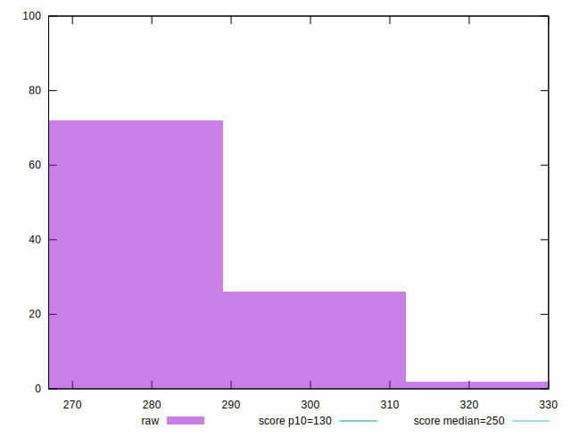
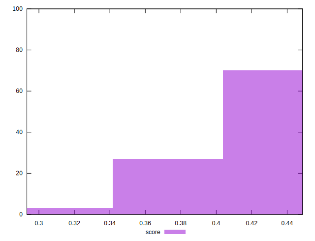

# //max-potential-fid/samples/pages+cached+nointeractive

[→ Parent](../..)


## Raw


```yaml
p90min: 267
p90max: 297
p90range: 30
p90mean: 277.2555555555555
p90median: 273
p90stdev: 9.192462021933535
p90skewness: 1.1593926379977757
p90eccentricity: 0.9999999999999999
p90discretization: 2
outlandishness: 1.0205509535259674

```


## Score


```yaml
p90min: 0.2931873605519907
p90max: 0.44005621242606846
p90range: 0.14686885187407778
p90mean: 0.40958565206306086
p90median: 0.42871468007592217
p90stdev: 0.032869939206784195
p90skewness: -1.121367744491244
p90eccentricity: 0.9999999999999999
p90discretization: 1.875
outlandishness: 1.0166322425922427

```

