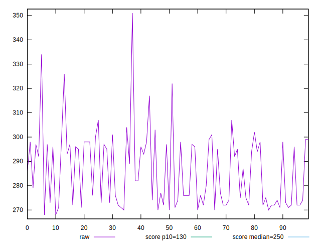
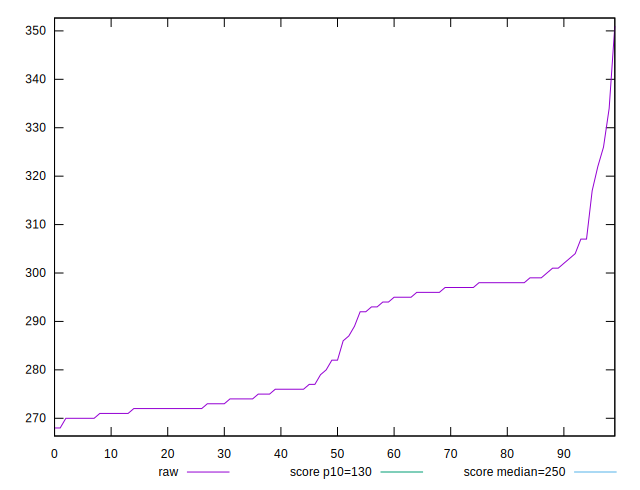
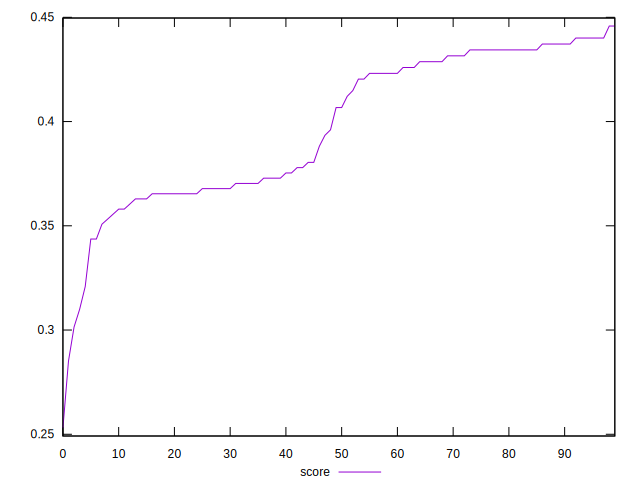
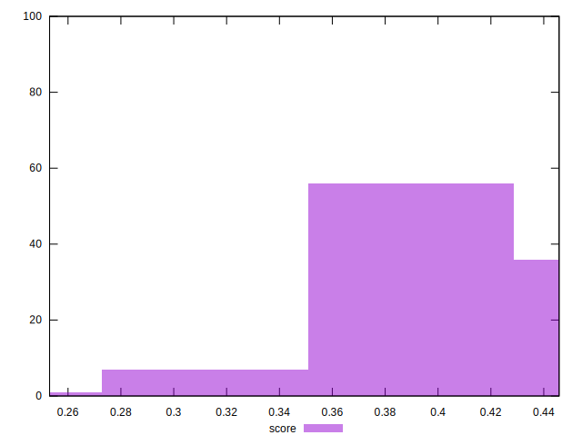

# //max-potential-fid/samples/pages+cached

[→ Parent](../..)


## Raw


```yaml
p90min: 267.9999999999982
p90max: 301
p90range: 33.00000000000182
p90mean: 283.12222222222215
p90median: 276.5
p90stdev: 11.681731014972748
p90skewness: 0.25202000981033534
p90eccentricity: 0.9999999999999997
p90discretization: 2.1951219512195124
outlandishness: 1.024289206355332

```


## Score


```yaml
p90min: 0.25302431296883876
p90max: 0.4372001439927725
p90range: 0.18417583102393376
p90mean: 0.39142109050089113
p90median: 0.38043458827040655
p90stdev: 0.03908045200403319
p90skewness: -0.7518823364449715
p90eccentricity: 0.9999999999999993
p90discretization: 1.9565217391304348
outlandishness: 1.0253046998461024

```

