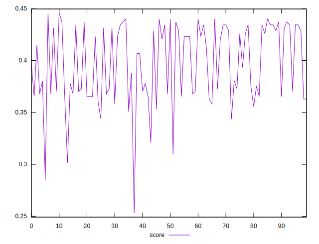

# //max-potential-fid/samples/pages+cached

[→ Parent](../..)


## Raw


```yaml
p90min: 269.9999999999982
p90max: 303.9999999999982
p90range: 34
p90mean: 284.10989010988993
p90median: 279
p90stdev: 11.916790767053309
p90skewness: 0.18427060224191733
p90eccentricity: 1.0000000000000002
p90discretization: 2.1666666666666665
outlandishness: 1.0171799915783468

```


## Score


```yaml
p90min: 0.35076068472419847
p90max: 0.44005621242607357
p90range: 0.0892955277018751
p90mean: 0.4020322163574413
p90median: 0.41484959569195007
p90stdev: 0.03159908313361344
p90skewness: -0.1628709358659865
p90eccentricity: 0.9999999999999993
p90discretization: 2.1666666666666665
outlandishness: 0.9718957454191441

```

