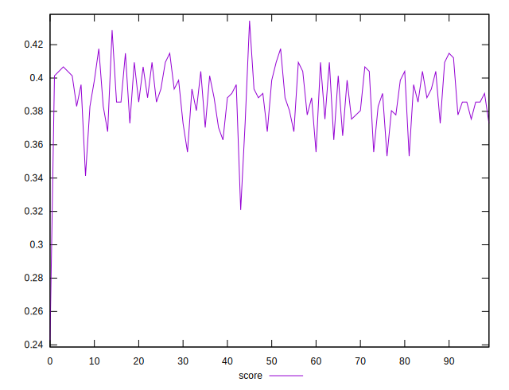

# //max-potential-fid/samples/pages

[→ Parent](../..)


## Raw


```yaml
p90min: 277.9999999999982
p90max: 302
p90range: 24.00000000000182
p90mean: 288.04395604395603
p90median: 288
p90stdev: 5.5843424906621415
p90skewness: 0.19168930708306745
p90eccentricity: 0.9999999999999999
p90discretization: 2.116279069767442
outlandishness: 1.010135425725195

```


## Score


```yaml
p90min: 0.3555676813469126
p90max: 0.41759477713855103
p90range: 0.062027095791638454
p90mean: 0.3908752142007509
p90median: 0.39077190547644314
p90stdev: 0.014545021331884553
p90skewness: -0.1378709389809275
p90eccentricity: 0.9999999999999993
p90discretization: 2.116279069767442
outlandishness: 0.9830503250713165

```

