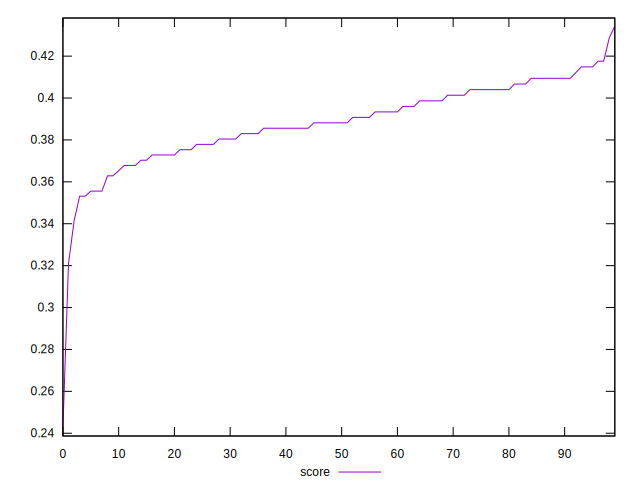

# //max-potential-fid/samples/pages

[→ Parent](../..)


## Raw


```yaml
p90min: 271.9999999999982
p90max: 298
p90range: 26.00000000000182
p90mean: 287.31111111111096
p90median: 287.9999999999991
p90stdev: 5.586977804471396
p90skewness: -0.19105638994662158
p90eccentricity: 1.000000000000001
p90discretization: 2.142857142857143
outlandishness: 1.015295105994298

```


## Score


```yaml
p90min: 0.2425197073059409
p90max: 0.40940109850833006
p90range: 0.16688139120238915
p90mean: 0.3842345987455429
p90median: 0.3868709267087984
p90stdev: 0.022534284176339927
p90skewness: -3.0386142800944356
p90eccentricity: 0.9999999999999996
p90discretization: 2.142857142857143
outlandishness: 1.017323503399998

```

