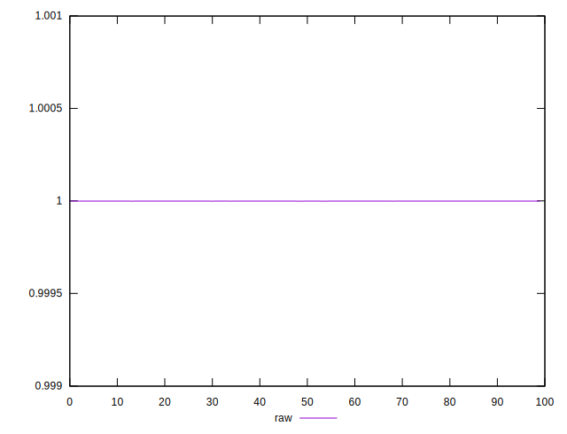
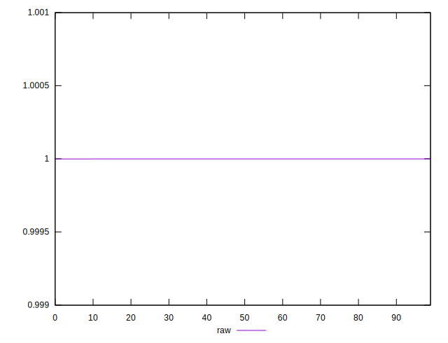
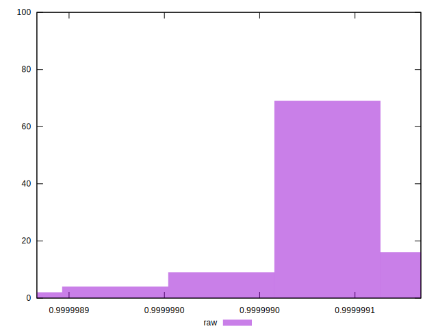

# //meta/score/samples/empty

[→ Parent](../..)


## Raw


```yaml
p90min: 0.9999989804455924
p90max: 0.9999990838685003
p90range: 1.0342290790443798e-7
p90mean: 0.999999035326048
p90median: 0.9999990341449824
p90stdev: 2.2566988653926656e-8
p90skewness: 0.01836799655349533
p90eccentricity: 1.0000000000000004
p90discretization: 1
outlandishness: 0.999999987473045

```

