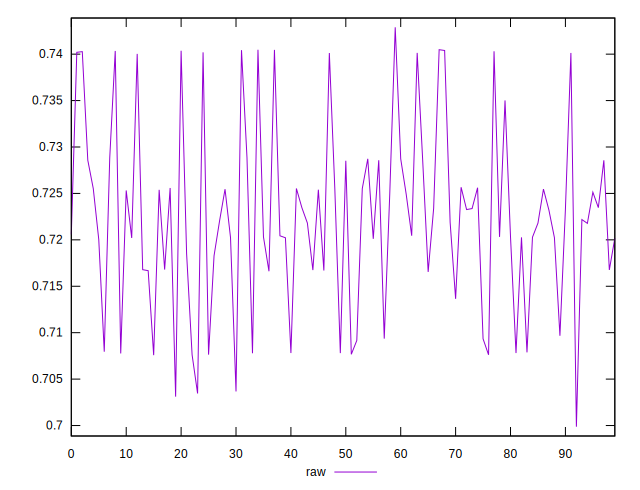

# //meta/score/samples/pages+cached+noadtech

[→ Parent](../..)


## Raw


```yaml
p90min: 0.7075793777629918
p90max: 0.7403951852394232
p90range: 0.03281580747643131
p90mean: 0.7223070322849509
p90median: 0.7218977830706907
p90stdev: 0.009283518656370405
p90skewness: 0.27621434251559773
p90eccentricity: 1.0000000000000002
p90discretization: 1
outlandishness: 1.0003898482371836

```

