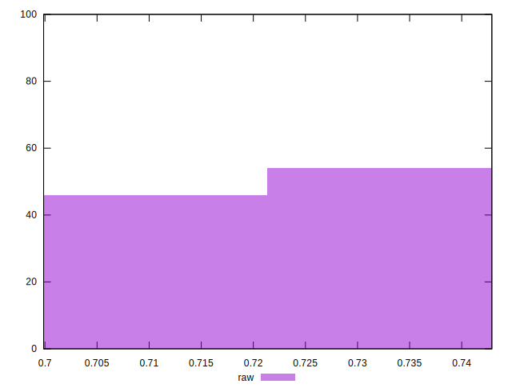

# //meta/score/samples/pages+cached+noadtech

[→ Parent](../..)


## Raw


```yaml
p90min: 0.6998718858472739
p90max: 0.7401991465160057
p90range: 0.040327260668731824
p90mean: 0.7204261600810099
p90median: 0.7205127896405236
p90stdev: 0.009112630970732725
p90skewness: 0.02974335563591044
p90eccentricity: 1.0000000000000002
p90discretization: 1
outlandishness: 1.0056202570962172

```

