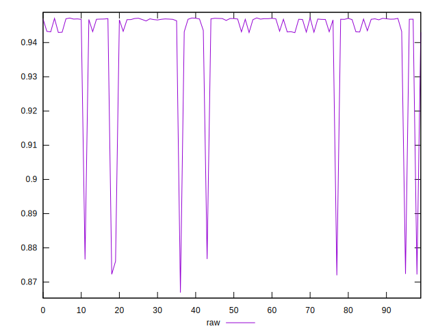

# //meta/score/samples/pages+cached+noexternal+nocss

[→ Parent](../..)


## Raw


```yaml
p90min: 0.8669269914328439
p90max: 0.9470706833956636
p90range: 0.08014369196281967
p90mean: 0.9393812277821032
p90median: 0.9467588721930864
p90stdev: 0.02076502361298283
p90skewness: -2.870357324106037
p90eccentricity: 1
p90discretization: 1
outlandishness: 1.0016523109972943

```

