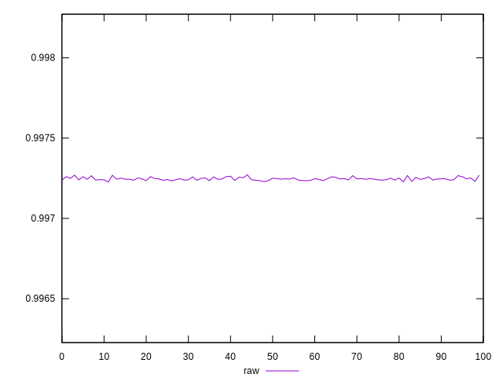
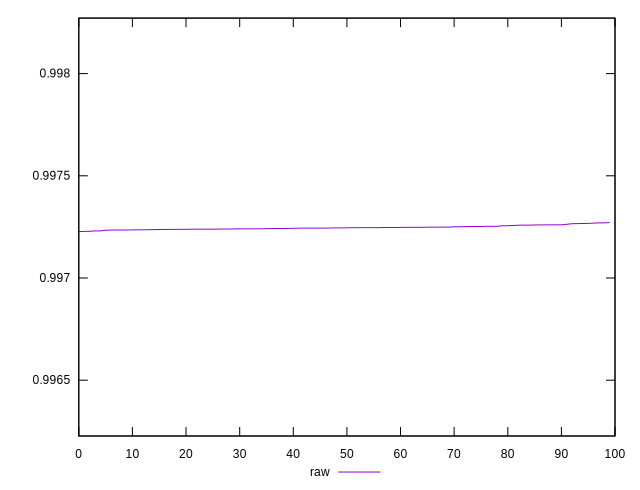
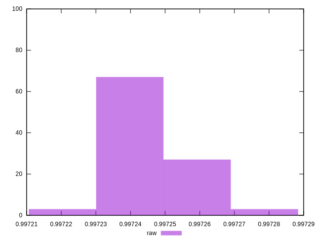

# //meta/score/samples/pages+cached+noexternal+nofonts+nosvg+noimg+nocss+nojs

[→ Parent](../..)


## Raw


```yaml
p90min: 0.9972267629320367
p90max: 0.9972598395093114
p90range: 0.000033076577274693264
p90mean: 0.9972441221310722
p90median: 0.9972439773385439
p90stdev: 0.00000787331735647993
p90skewness: 0.1655245144468554
p90eccentricity: 1.0000000000000002
p90discretization: 1.0112359550561798
outlandishness: 1.0000045150738437

```

