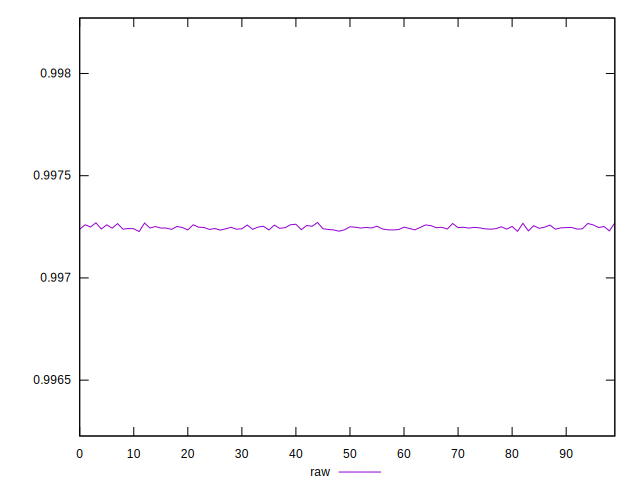
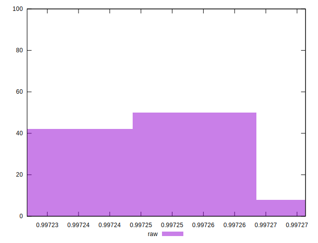

# //meta/score/samples/pages+cached+noexternal+nofonts+nosvg+noimg+nocss+nojs

[→ Parent](../..)


## Raw


```yaml
p90min: 0.9972278955956739
p90max: 0.9972626397141333
p90range: 0.00003474411845938441
p90mean: 0.9972446914374236
p90median: 0.9972441047591099
p90stdev: 0.000008014310290945756
p90skewness: 0.2752778781924589
p90eccentricity: 0.9999999999999997
p90discretization: 1.011111111111111
outlandishness: 1.0000033733104146

```

