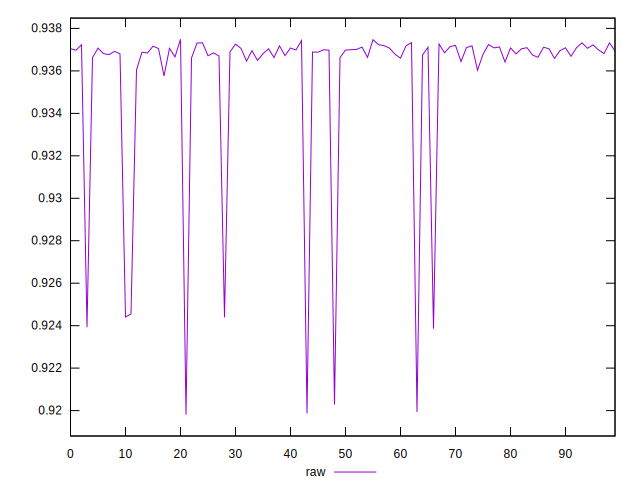
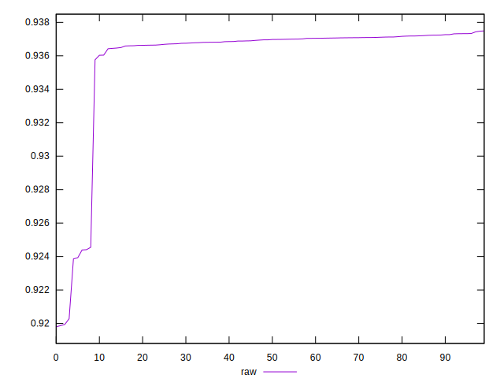
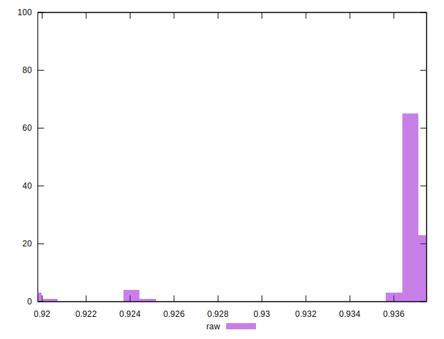

# //meta/score/samples/pages+cached+noexternal+nofonts+nosvg+noimg+nocss

[→ Parent](../..)


## Raw


```yaml
p90min: 0.935759916881441
p90max: 0.9374868255315372
p90range: 0.0017269086500961706
p90mean: 0.9369348342333168
p90median: 0.9369912869497834
p90stdev: 0.00030234462152653745
p90skewness: -1.113466430856976
p90eccentricity: 0.9999999999999999
p90discretization: 1
outlandishness: 0.997197408874838

```

