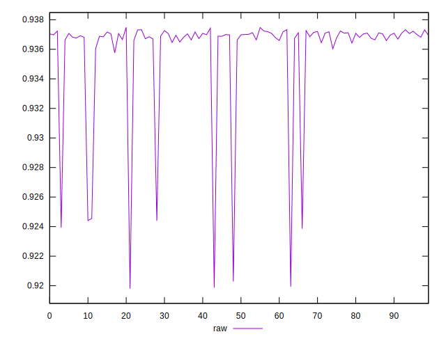

# //meta/score/samples/pages+cached+noexternal+nofonts+nosvg+noimg+nocss

[→ Parent](../..)


## Raw


```yaml
p90min: 0.9198022809900381
p90max: 0.9372411517242878
p90range: 0.017438870734249656
p90mean: 0.935428586780608
p90median: 0.9368921364077063
p90stdev: 0.004423514552044829
p90skewness: -2.7651024455220177
p90eccentricity: 1.0000000000000007
p90discretization: 1
outlandishness: 1.0004114123289112

```

