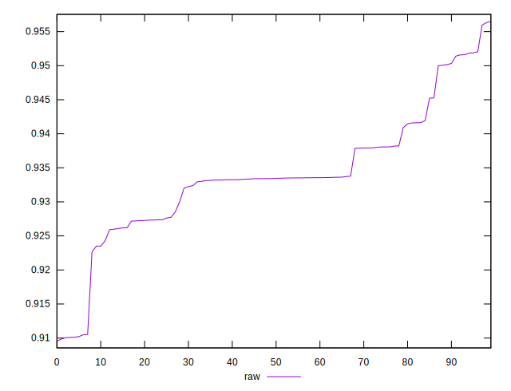
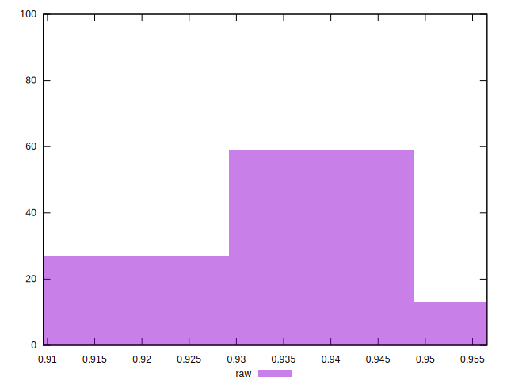

# //meta/score/samples/pages+cached+noexternal+nofonts+nosvg+noimg

[→ Parent](../..)


## Raw


```yaml
p90min: 0.909549516258911
p90max: 0.9501708436203735
p90range: 0.04062132736146251
p90mean: 0.9316085029210311
p90median: 0.9333787147318433
p90stdev: 0.008735016271721945
p90skewness: -0.841126905860961
p90eccentricity: 1.0000000000000002
p90discretization: 1
outlandishness: 1.0045873225631081

```

