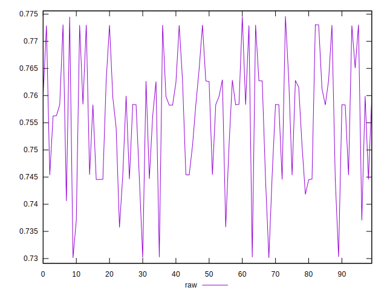
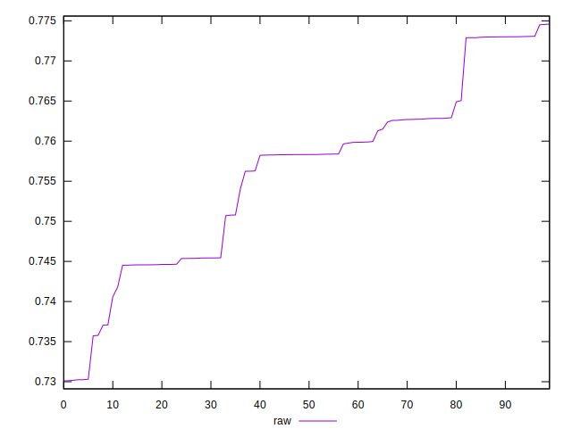

# //meta/score/samples/pages+cached+noexternal+nofonts

[→ Parent](../..)


## Raw


```yaml
p90min: 0.73011125244291
p90max: 0.7730056922883994
p90range: 0.04289443984548946
p90mean: 0.753920720635296
p90median: 0.7583046521676382
p90stdev: 0.011345115007865603
p90skewness: -0.38020108939719627
p90eccentricity: 0.9999999999999997
p90discretization: 1
outlandishness: 1.0051973106458352

```

