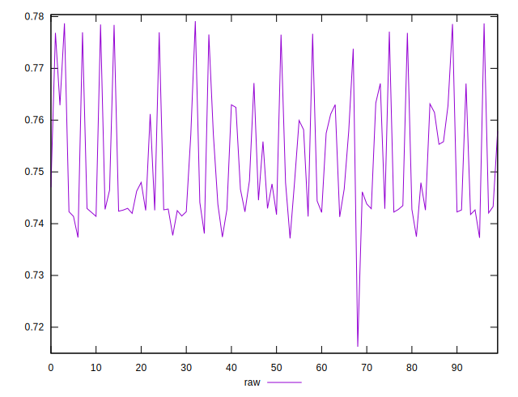
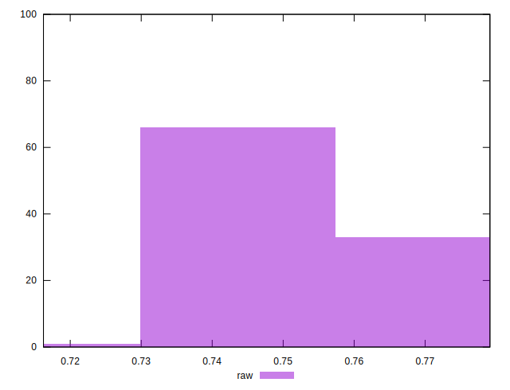

# //meta/score/samples/pages+cached+noexternal+noimg

[→ Parent](../..)


## Raw


```yaml
p90min: 0.7162280112814366
p90max: 0.7768513663966411
p90range: 0.06062335511520445
p90mean: 0.7490451698414355
p90median: 0.7436171730068755
p90stdev: 0.011032069094501407
p90skewness: 0.7386706585106438
p90eccentricity: 1.0000000000000004
p90discretization: 1
outlandishness: 1.0077411593894192

```

