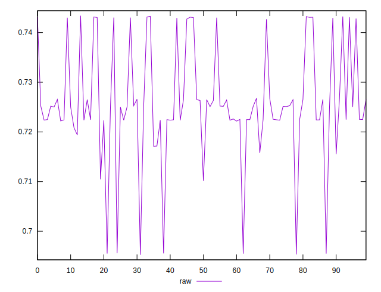
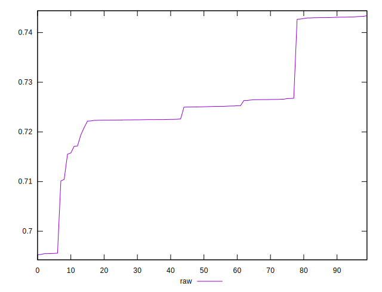

# //meta/score/samples/pages+cached+noexternal+nosvg

[→ Parent](../..)


## Raw


```yaml
p90min: 0.7101377952085194
p90max: 0.7432376532437743
p90range: 0.03309985803525495
p90mean: 0.7276207815590165
p90median: 0.7250972841645769
p90stdev: 0.008694275187946895
p90skewness: 0.8624169292740288
p90eccentricity: 0.9999999999999996
p90discretization: 1
outlandishness: 0.9946813624906136

```

