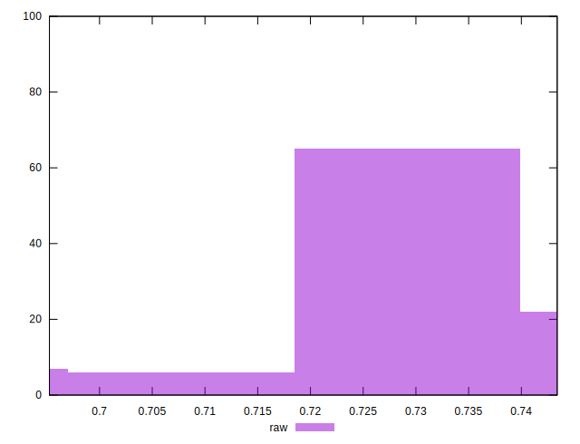

# //meta/score/samples/pages+cached+noexternal+nosvg

[→ Parent](../..)


## Raw


```yaml
p90min: 0.6952478887018282
p90max: 0.7430525144602319
p90range: 0.04780462575840372
p90mean: 0.7237393104277933
p90median: 0.7249914475687413
p90stdev: 0.01097418850957359
p90skewness: -0.6713330218458389
p90eccentricity: 1.0000000000000002
p90discretization: 1
outlandishness: 1.005379081676713

```

