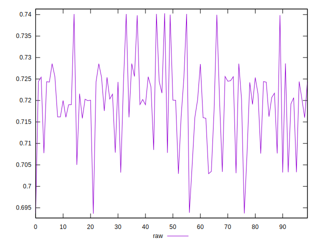
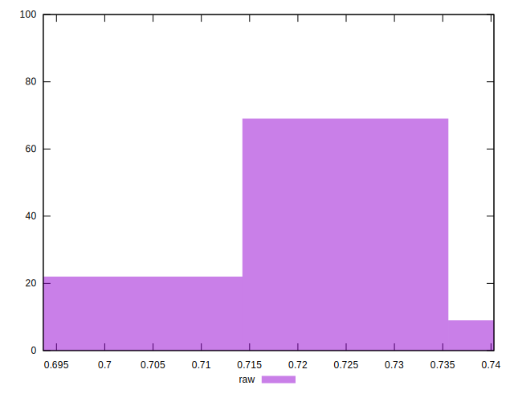

# //meta/score/samples/pages+cached+noexternal

[→ Parent](../..)


## Raw


```yaml
p90min: 0.693633431382311
p90max: 0.728581497983053
p90range: 0.03494806660074201
p90mean: 0.7171997709319323
p90median: 0.7200614245309944
p90stdev: 0.008958307821644727
p90skewness: -1.0263673411716685
p90eccentricity: 1.0000000000000004
p90discretization: 1
outlandishness: 1.0060636019051723

```

