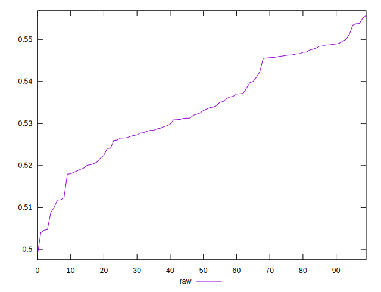
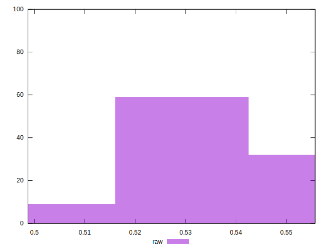

# //meta/score/samples/pages+cached+nointeractive

[→ Parent](../..)


## Raw


```yaml
p90min: 0.4987142483890919
p90max: 0.5488522803051366
p90range: 0.050138031916044656
p90mean: 0.5314289395624566
p90median: 0.5312495592971285
p90stdev: 0.012163142049573325
p90skewness: -0.43747788784988806
p90eccentricity: 0.9999999999999999
p90discretization: 1
outlandishness: 1.0077799917539831

```

