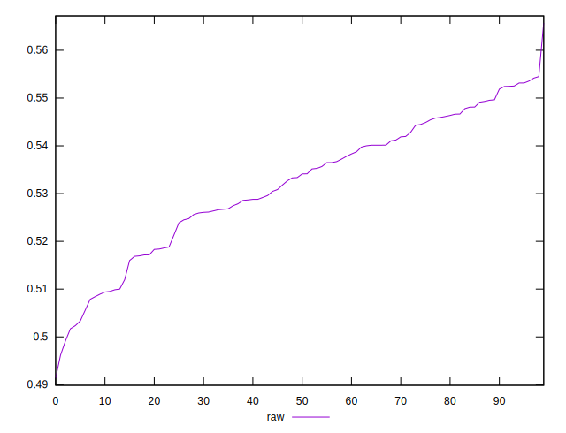

# //meta/score/samples/pages+cached

[→ Parent](../..)


## Raw


```yaml
p90min: 0.4913536541653386
p90max: 0.5496362672494195
p90range: 0.05828261308408089
p90mean: 0.5293744596987078
p90median: 0.5306600210317044
p90stdev: 0.014248084901250136
p90skewness: -0.591167509592123
p90eccentricity: 1.0000000000000002
p90discretization: 1
outlandishness: 1.0094594278416689

```

