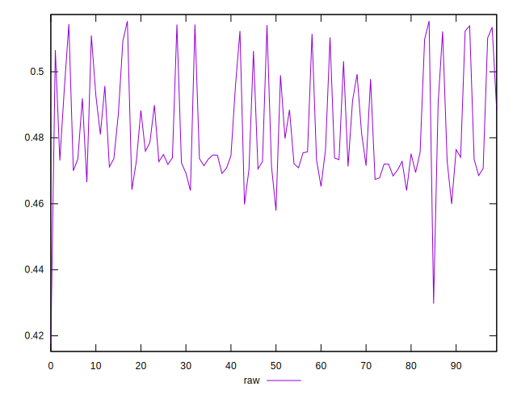

# //meta/score/samples/pages

[→ Parent](../..)


## Raw


```yaml
p90min: 0.4172165056100327
p90max: 0.5122306107675242
p90range: 0.09501410515749148
p90mean: 0.4782930483433612
p90median: 0.4736476735280315
p90stdev: 0.01598978087006614
p90skewness: -0.10151260512516895
p90eccentricity: 0.9999999999999996
p90discretization: 1
outlandishness: 1.014990044947144

```

