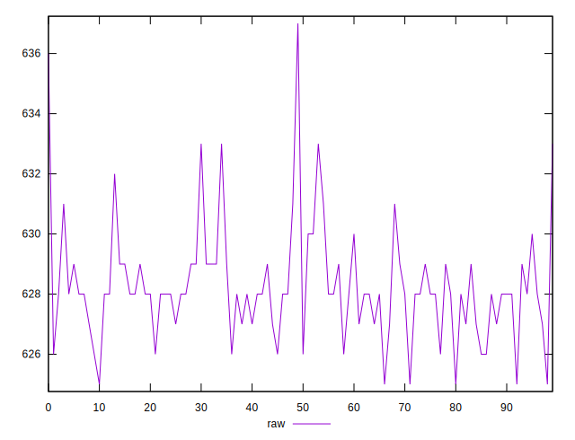
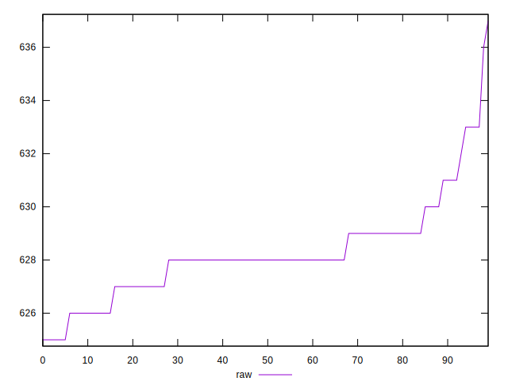
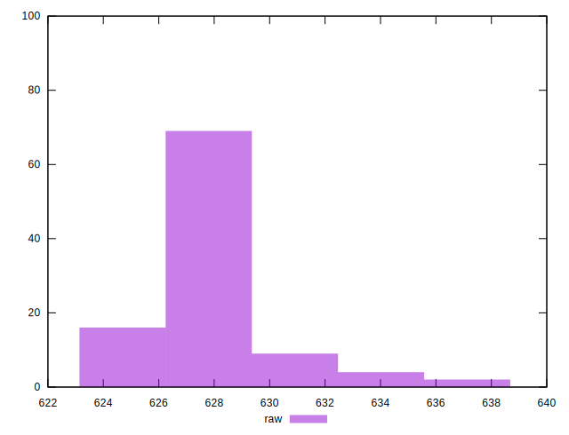

# //metrics/samples/empty

[→ Parent](../..)


## Raw


```yaml
p90min: 625
p90max: 631
p90range: 6
p90mean: 627.7555555555556
p90median: 628
p90stdev: 1.2588452478460934
p90skewness: -0.4015599915230198
p90eccentricity: 1
p90discretization: 12.857142857142858
outlandishness: 1.0016715535451217

```

