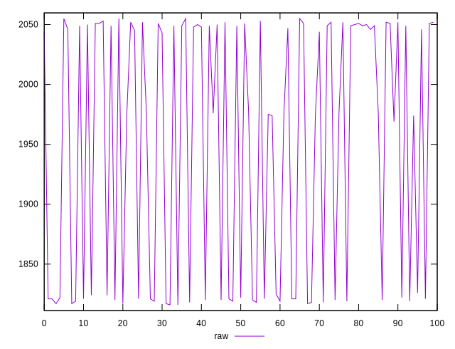
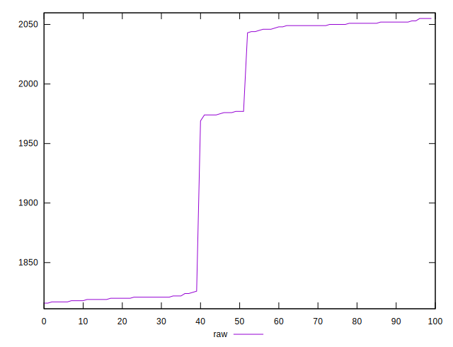
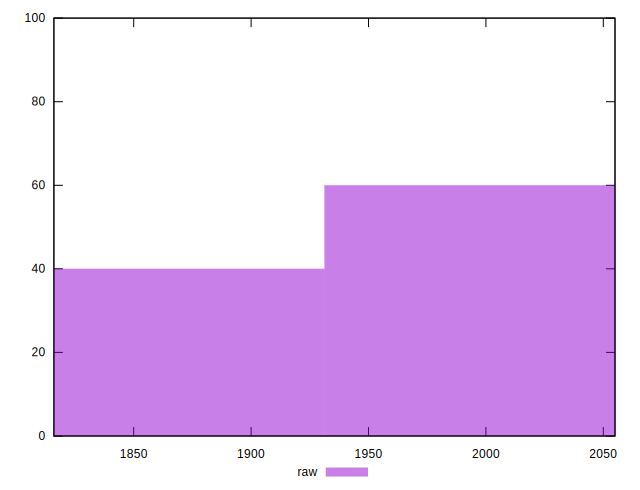

# //metrics/samples/pages+cached+noadtech

[→ Parent](../..)


## Raw


```yaml
p90min: 1818
p90max: 2055
p90range: 237
p90mean: 1961.978021978022
p90median: 2044
p90stdev: 104.38506250996028
p90skewness: -0.5264866207861549
p90eccentricity: 0.9999999999999993
p90discretization: 3.64
outlandishness: 0.9867433434293992

```

