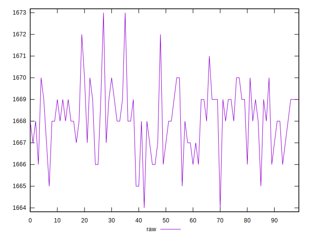
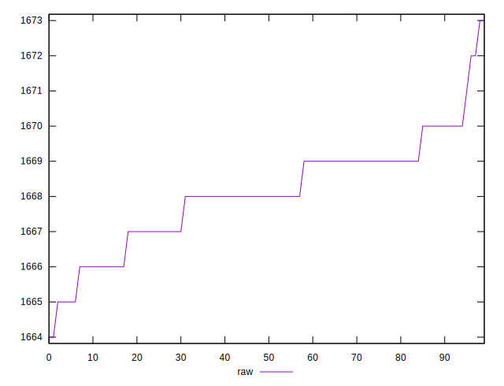
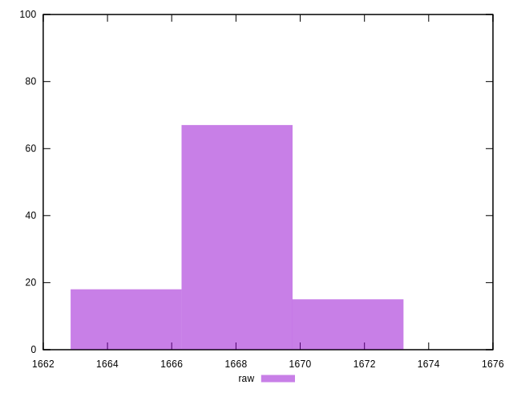

# //metrics/samples/pages+cached+noexternal+nocss

[→ Parent](../..)


## Raw


```yaml
p90min: 1665
p90max: 1671
p90range: 6
p90mean: 1668.098901098901
p90median: 1668
p90stdev: 1.2843516776867685
p90skewness: -0.34039529147903136
p90eccentricity: 0.9999999999999992
p90discretization: 13
outlandishness: 1.000001317549529

```

