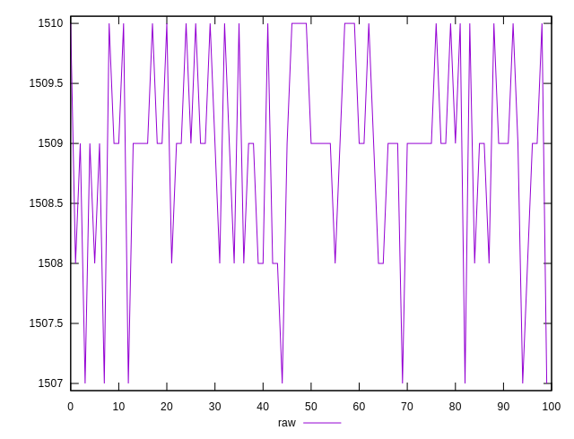
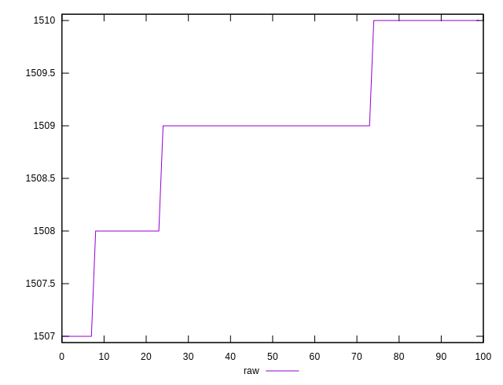
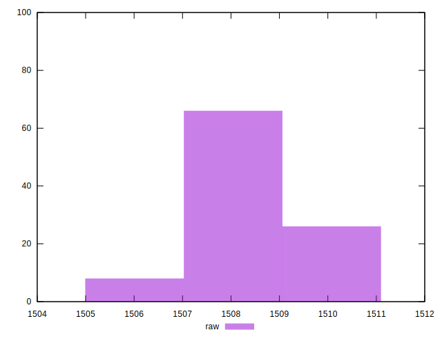

# //metrics/samples/pages+cached+noexternal+nofonts+nosvg+noimg+nocss+nojs

[→ Parent](../..)


## Raw


```yaml
p90min: 1507
p90max: 1510
p90range: 3
p90mean: 1508.8222222222223
p90median: 1509
p90stdev: 0.8243216440440626
p90skewness: -0.6125152291849618
p90eccentricity: 0.9999999999999988
p90discretization: 22.5
outlandishness: 1.000156124920319

```

