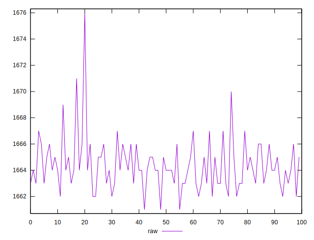
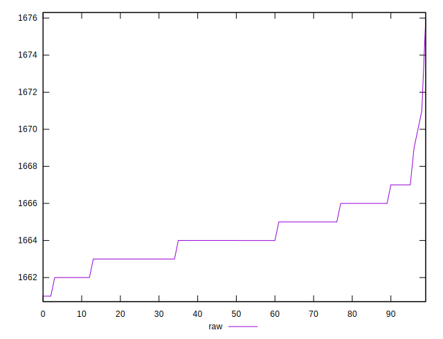
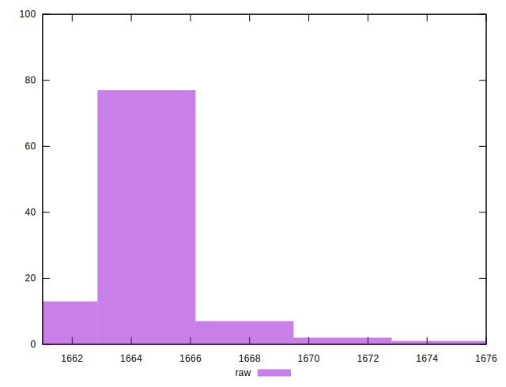

# //metrics/samples/pages+cached+noexternal+nofonts+nosvg+noimg+nocss

[→ Parent](../..)


## Raw


```yaml
p90min: 1662
p90max: 1667
p90range: 5
p90mean: 1664.131868131868
p90median: 1664
p90stdev: 1.3441676309052504
p90skewness: 0.2748673936686432
p90eccentricity: 1.0000000000000009
p90discretization: 15.166666666666666
outlandishness: 1.000310254124859

```

